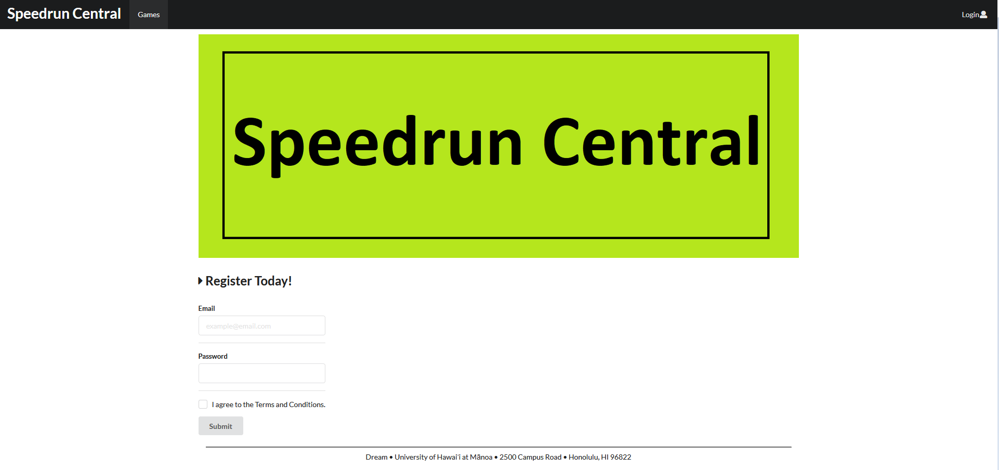
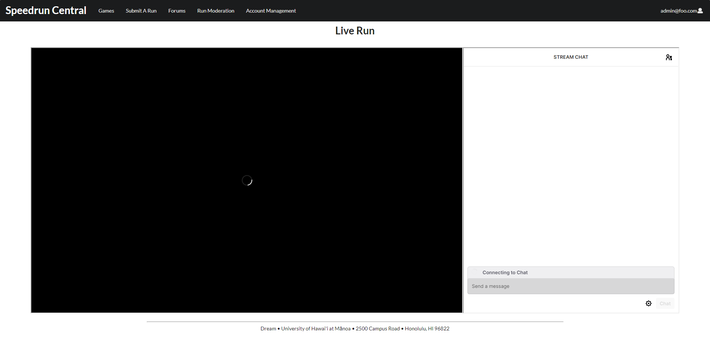
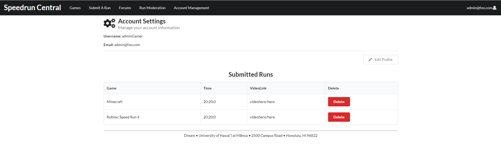
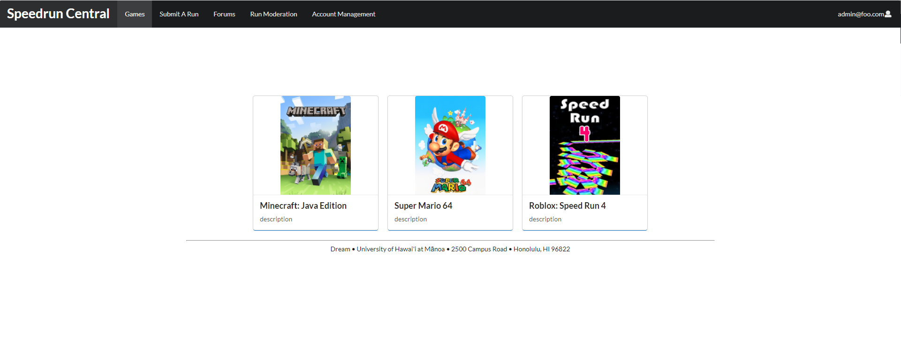
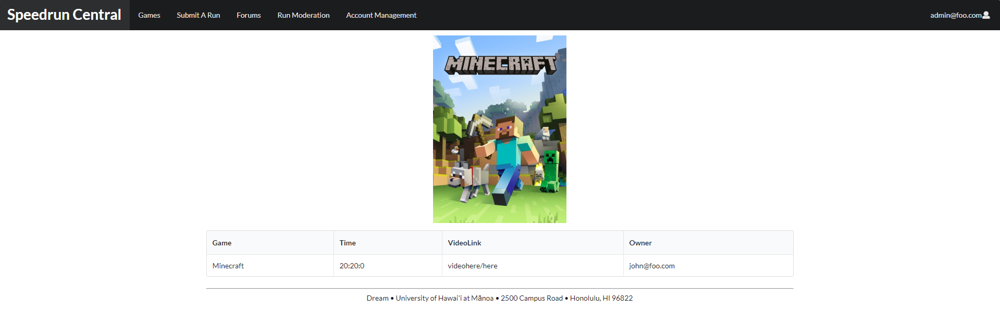
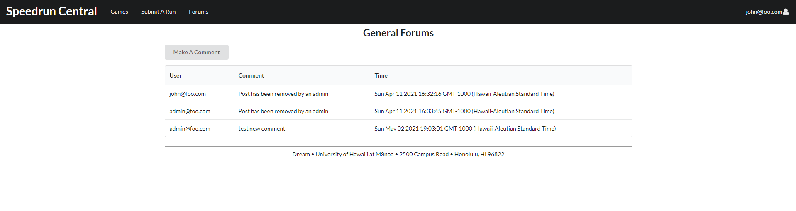
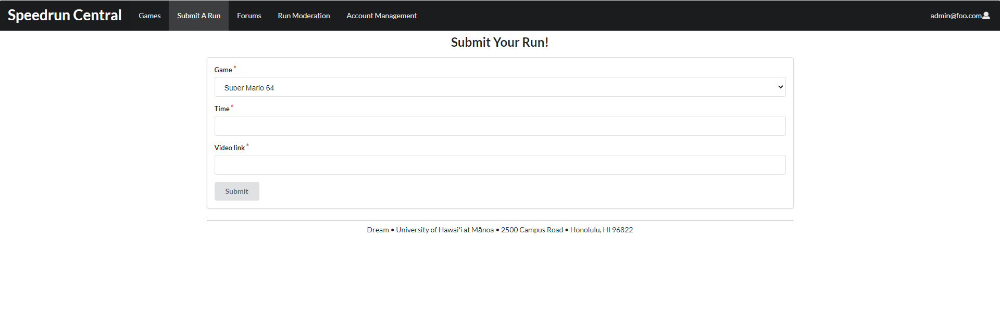

For details on the template and how to install as well as how to run the code on your computer, please see http://ics-software-engineering.github.io/meteor-application-template-react/

# RELEASE

## Roles and responsibilities: 

The responsibilities are generally towards finishing up the last bits of the program since we completed the program on checkpoint 3.

 ### Joel:
Completed
  - Wiki page creation
  - Final code review

### Jhun:
Completed
  - README.txt edits
  - Final code review

### Cade:
Completed
  - Incident reponse plan
  - Final security review

# _______________________________________________________________

## Links

## Online Repository
https://github.com/joelsikkink/Speedrun-Central

## Final Project Documentation
https://github.com/joelsikkink/Speedrun-Central/blob/main/README.md

## Version Release
https://github.com/joelsikkink/Speedrun-Central/releases/tag/1.0

## Wiki Page
https://github.com/joelsikkink/Speedrun-Central/wiki

# _______________________________________________________________

## Instilation Instructions

1. Install [Meteor](https://www.meteor.com/install).

2. Download a copy of the [Speedrun Central App](https://github.com/joelsikkink/Speedrun-Central) from our GitHub Repo. You may clone it using git.

3. In your terminal, cd into the app/ directory of your Waggle Application and install the necessary npm libraries by running the following command:

``` $ meteor npm install ```

4. Run the app with the following command:

``` $ meteor npm run start ```

The app should now be available at [http://localhost:3000](http://localhost:3000).

# Guided Tour

## Landing Page
Users who are logged out will find themselves to a basic page our app on the landing page. It contains a banner of our website and a way for users to register and be able to use our application. Once created and logged in, users will be able to use all functionality of our application.



## User Homepage
Once logged in the landing page will be replaced with a twitch stream and chat. Users will be able to watch live speedrun attempts through our page and interact with the speedrun's personal twitch chat to be apart of their community.



## User Profile Page
The user profile page is where users can view and edit their profile information. This page also contain a list of all run submissions from the user.



## Game Page
The games tab will lead a user to a page that consists of all the current games available to the user to be able to submit their speedrun attempts. Each game page consists of a leaderboard of the submitted runs from users of the application.




## Forum Page
The forum page is where users will be able to communicate with other users of the application to share and discuss about speedruning games.



## Speedrun Attempt Submission Page
The speedrun attempt submission page is where users will be able to submit their speedrun attempts to the applications. Each speedrun attempt will be evaluated by admins to check for legitimacy. User submissions require the game category of the attempt, the speedrun time of the attempt, and a link to a video of the speedrun attempt.



# _______________________________________________________________

## Dev Notes

### Joel
- I learned a lot more about MongoDB while working on this project. There were some issues I faced learning it but I figured them out.
- There were many small details that I enjoyed adding to the final implementation like the image in the browser tab and the post counter for the forums landing page.
- I wish I had sorted the runs by time but that never got implemented. The runs simply just show 

### Jhun
- One main challenge I faced was implementing a way for users to edit their profile information.
- The most important achievement that I'm proud of is the twitch stream and chat implimentation for the application.
- One disappointment was not being able to fix a problem with users editing their profiles.

### Cade
- As the lead for security policy and review, I found some difficulties at first when it came to ensuring that our application is up to par with our security standards, however I eventually figured out effective methods for reviewing our codebase and application.
- I learned a lot about how to implement a SDL plan and see it through until the final release.
- Although I wish we were able to use a dynamic analysis tool, I am proud of the work that we put in the ensure the security of our application.

# _______________________________________________________________


# CHECKPOINT 3 (03/22/2021 - 04/11/2021)

## Progress:

The site is basically complete, functioning, accessible, and all core parts are implemented
  - Accounts fully working and implemented
  - Game pages fully working and implemented
  - Forums pages fully working and implemented
  - User profile pages fully working and implemented
  - Admin management pages fully working and implemented
  - All dbs are fully working and implemented
  - Lasting bugs were sqashed out

## Link: 
https://github.com/joelsikkink/Speedrun-Central

## Pending:
- Possible QoL fixes
- Site beautification

## Roles and responsibilities: 

The responsibilities are generally the same as the previous checkpoints as we all did our respective parts and the site was, for the most part, completed.

 ### Joel:
Completed
  - Fully completed forums
  - Fully completed speedrun data management
  - Bugfixing on pages and in dbs
  
Current & Next
  - Working on beautification of the site and QoL fixes.

### Jhun:
Completed
  - Fully completed profile pages
  - Fully complteted game pages
  - Bugfixing on pages and in dbs
   
Current & Next
  - Working on beautification of the site and QoL fixes.

### Cade:
Completed
  - Did the dynamic & static analysis portion of this checkpoint.
  - Did the security audit (Fuzz test) for this checkpoint.
  
Current & Next
  - Working on beautification of the site and QoL fixes.
  - Will be working on the code security audits and checks
  
# _______________________________________________________________


# CHECKPOINT 2 (02/21/2021 - 03/21/2021)

## Progress:

The site is up and running with accounts fully implemented

The site accepts user submitted runs

The site has a game list page with pages for each of the 3 current games on the site

There are now user profiles for both the admins and general users

There are dashboard for both admins and general users


## Link: 
https://github.com/joelsikkink/Speedrun-Central

## Pending:

We need to continue working on the forums area

General polishing:
  - User profile polish
  - Game page polish
  - Admin dashboard polish
 
Unite the site's overall look

## Roles and responsibilities: 

The responsibilities are generally the same as the last checkpoint as most of what is left is polishing existing components that each individual has worked on.

 ### Joel:
Completed
  - Worked on admin dashboard & associated collections

  - Worked further on run submissions & associated collections
  
Current & Next
  - Will be working on polishing up the admin dashboard/landing page
  
  - Will be working further on forums page

### Jhun:
Completed
  - Worked on the user profiles & associated collections

  - Worked on the game pages & associated collections
   
Current & Next
  - Will be working on polsihing the user profile page
  
  - Will be working on polishing and completing game pages

### Cade:
Completed
  - Did the Dynamic Analysis portion of this checkpoint
  
  - Did the security audit for this checkpoint
  
Current & Next
  - Worked/ Working on the games & list pages further
  
  - Will be working on the code security audits and checks
  
  - Uniting the overall look and design of the site
  
# _______________________________________________________________

# CHECKPOINT 1 (02/20/2021)
# What is complete so far:

Template has been installed and is runnable

Games list page

Speedrun Submission form

Forums landing page

Landing page

# What is pending:

Create game specific pages with information regarding run times

Finish forums to allow discussion creation and responses

Create admin dashboard/landing page

Create user dashboard/landing page

Create per-user profiles

# Team work complete:

## Joel:

  -Created speedrun submission form
  
  -Created forums landing page
  
  -Will be working on admin dashboard/landing page
  
  -Will be working further on Forums page

## Jhun:

  -Worked on landing page
  
  -Created game page 1
  
  -Will be working on User landing page
  
  -Will be working on per-user profile pages

## Cade:

  -Created games list page
  
  -Will be working on separate game pages
  
  -Will be working on code security audit
# For further details on work completed and pending, please reference the "Issues" tab on Github.
